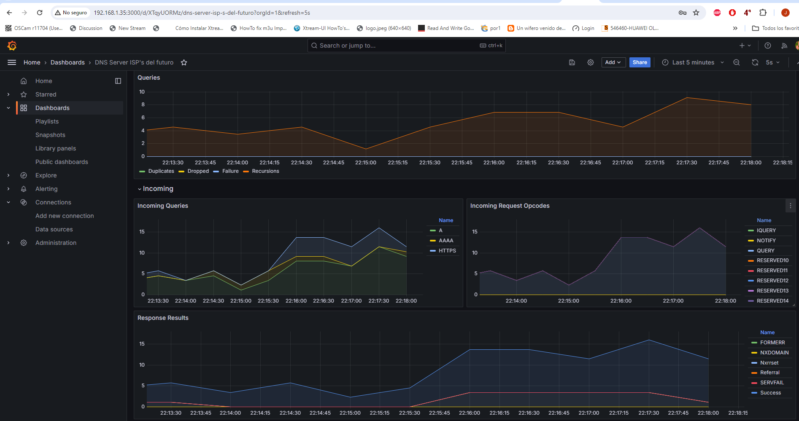

Para esto abrimos la consola de ubuntu e ingresamos en modo root
```
sudo su -
```
Ingresamos la contraseña y actualizo los repositorios
```
apt update
```
Descargamos prometheus
```
wget https://github.com/prometheus/prometheus/releases/download/v2.52.0/prometheus-2.52.0.linux-amd64.tar.gz
```
Descomprimimos el paquete con tar
```
tar xzf prometheus-2.52.0.linux-amd64.tar.gz
```
Movemos la carpeta extraida a /etc/prometheus
```
mv prometheus-2.52.0.linux-amd64 /etc/prometheus
```
Creamos el servicio en systemd para que inicie con el sistema
```
nano /etc/systemd/system/prometheus.service
```
Y pegamos lo siguiente dentro del archivo
```
[Unit]
Description=Prometheus
Wants=network-online.target
After=network-online.target

[Service]
ExecStart=/etc/prometheus/prometheus --config.file=/etc/prometheus/prometheus.yml
Restart=always
[Install]
WantedBy=multi-user.target
```
Recargamos el daemon
```
systemctl daemon-reload
```
Cargamos el servicio en el systemd
```
systemctl enable prometheus
```
Iniciamos el servicio
```
systemctl start prometheus
```
Ejecutamos el status del servicio
```
systemctl status prometheus
```
Si todo salió bien debemos tener la siguiente salida al ejecutar el status 
```
● prometheus.service - Prometheus
     Loaded: loaded (/etc/systemd/system/prometheus.service; enabled; vendor preset: enabled)
     Active: active (running) since Tue 2024-05-28 01:17:47 UTC; 3s ago
   Main PID: 3240 (prometheus)
      Tasks: 9 (limit: 4551)
     Memory: 16.3M
     CGroup: /system.slice/prometheus.service
             └─3240 /etc/prometheus/prometheus --config.file=/etc/prometheus/prometheus.yml

May 28 01:17:47 dns prometheus[3240]: ts=2024-05-28T01:17:47.396Z caller=head.go:703 level=info component=tsdb msg="On-disk memory mappable chunks replay completed" duration=806ns
May 28 01:17:47 dns prometheus[3240]: ts=2024-05-28T01:17:47.396Z caller=head.go:711 level=info component=tsdb msg="Replaying WAL, this may take a while"
May 28 01:17:47 dns prometheus[3240]: ts=2024-05-28T01:17:47.396Z caller=head.go:783 level=info component=tsdb msg="WAL segment loaded" segment=0 maxSegment=0
May 28 01:17:47 dns prometheus[3240]: ts=2024-05-28T01:17:47.396Z caller=head.go:820 level=info component=tsdb msg="WAL replay completed" checkpoint_replay_duration=15.393µs wal_replay_duration=109.645µs wbl_replay_duration=115ns chunk_snapshot_load_duration=0s mmap_chu>
May 28 01:17:47 dns prometheus[3240]: ts=2024-05-28T01:17:47.397Z caller=main.go:1150 level=info fs_type=EXT4_SUPER_MAGIC
May 28 01:17:47 dns prometheus[3240]: ts=2024-05-28T01:17:47.397Z caller=main.go:1153 level=info msg="TSDB started"
May 28 01:17:47 dns prometheus[3240]: ts=2024-05-28T01:17:47.397Z caller=main.go:1335 level=info msg="Loading configuration file" filename=/etc/prometheus/prometheus.yml
May 28 01:17:47 dns prometheus[3240]: ts=2024-05-28T01:17:47.397Z caller=main.go:1372 level=info msg="Completed loading of configuration file" filename=/etc/prometheus/prometheus.yml totalDuration=214.406µs db_storage=891ns remote_storage=670ns web_handler=293ns query_e>
May 28 01:17:47 dns prometheus[3240]: ts=2024-05-28T01:17:47.397Z caller=main.go:1114 level=info msg="Server is ready to receive web requests."
May 28 01:17:47 dns prometheus[3240]: ts=2024-05-28T01:17:47.397Z caller=manager.go:163 level=info component="rule manager" msg="Starting rule manager..."
```
Ingresamos a la IP_del_servidor:9090 por un navegador web y obtendremos la siguiente ventana


Vamos a Status->Target y debemos verificar que el Endpoint Metrics este UP, tal como se muestra en la siguiente foto


Ahora, procedemos a instalar bind exporter, obtenemos el paquete

```
wget https://github.com/prometheus-community/bind_exporter/releases/download/v0.7.0/bind_exporter-0.7.0.linux-amd64.tar.gz
```

Extraemos el paquete
```
tar xzf bind_exporter-0.7.0.linux-amd64.tar.gz
```

Movemos la carpeta extraida a /etc/bind_exporter
```
mv bind_exporter-0.7.0.linux-amd64 /etc/bind_exporter
```
Creamos el servicio en systemd para que inicie con el sistema
```
nano /etc/systemd/system/bind_exporter.service
```
Y pegamos lo siguiente dentro del archivo
```
[Unit]
Description=Bind Exporter
Wants=network-online.target
After=network-online.target
[Service]
ExecReload=/bin/kill -HUP $MAINPID
ExecStart=/etc/bind_exporter/bind_exporter \
  --bind.pid-file=/var/run/named/named.pid \
  --bind.timeout=20s \
  --web.listen-address=0.0.0.0:9153 \
  --web.telemetry-path=/metrics \
  --bind.stats-url=http://127.0.0.1:8053/ \
  --bind.stats-groups=server,view,tasks
Restart=always
[Install]
WantedBy=multi-user.target
```

Recargamos el daemon
```
systemctl daemon-reload
```
Cargamos el servicio en el systemd
```
systemctl enable bind_exporter
```
Iniciamos el servicio
```
systemctl start bind_exporter
```
Ejecutamos el status del servicio
```
systemctl status prometheus
```
Si todo salió bien debemos tener la siguiente salida al ejecutar el status 
```
● bind_exporter.service - Bind Exporter
     Loaded: loaded (/etc/systemd/system/bind_exporter.service; enabled; vendor preset: enabled)
     Active: active (running) since Tue 2024-05-28 01:41:17 UTC; 4s ago
   Main PID: 3355 (bind_exporter)
      Tasks: 5 (limit: 4551)
     Memory: 1.7M
     CGroup: /system.slice/bind_exporter.service
             └─3355 /etc/bind_exporter/bind_exporter --bind.pid-file=/var/run/named/named.pid --bind.timeout=20s --web.listen-address=0.0.0.0:9153 --web.telemetry-path=/metrics --bind.stats-url=http://127.0.0.1:8053/ --bind.stats-groups=server,view,tasks

May 28 01:41:17 dns systemd[1]: Started Bind Exporter.
May 28 01:41:17 dns bind_exporter[3355]: level=info ts=2024-05-28T01:41:17.912Z caller=bind_exporter.go:558 msg="Starting bind_exporter" version="(version=0.7.0, branch=HEAD, revision=b9e01efa3fa37e78c65b2f09e84e027a954b5d32)"
May 28 01:41:17 dns bind_exporter[3355]: level=info ts=2024-05-28T01:41:17.912Z caller=bind_exporter.go:559 msg="Build context" build_context="(go=go1.20.7, platform=linux/amd64, user=root@e6068f3fc710, date=20230811-20:19:28, tags=netgo static_build)"
May 28 01:41:17 dns bind_exporter[3355]: level=info ts=2024-05-28T01:41:17.912Z caller=bind_exporter.go:560 msg="Collectors enabled" collectors=server,view,tasks
May 28 01:41:17 dns bind_exporter[3355]: level=info ts=2024-05-28T01:41:17.912Z caller=tls_config.go:274 msg="Listening on" address=[::]:9153
May 28 01:41:17 dns bind_exporter[3355]: level=info ts=2024-05-28T01:41:17.912Z caller=tls_config.go:277 msg="TLS is disabled." http2=false address=[::]:9153
```

Modificamos el archivo /etc/prometheus/prometheus.yml 

```
nano /etc/prometheus/prometheus.yml
```
Y añadimos el worker al final del archivo
```
- job_name: 'bind_exporter'
    static_configs:
      - targets: ['127.0.0.1:9153']
        labels:
          alias: bind_exporter
```

Reiniciamos el servicio de prometheus

```
systemctl restart prometheus.service
```

Ahora añadimos un canal statico en bind para sacar la metadata

```
nano /etc/bind/named.conf.options
```

Y añadimos lo siguiente al final del archivo

```
statistics-channels {
  inet 127.0.0.1 port 8053 allow { 127.0.0.1; };
};
```
Probamos que la configuración este bien, no debe arrojar nada a la salida
```
named-checkconf
```

Y reiniciamos el servicio de bind
```
systemctl restart bind9
```

Ahora en Status->Target tenemos el endpoint metrics arriba y funcionando


Procedemos a instalar Grafana en nuestro sistema
```
sudo apt-get install -y adduser libfontconfig1 musl
wget https://dl.grafana.com/enterprise/release/grafana-enterprise_11.0.0_amd64.deb
sudo dpkg -i grafana-enterprise_11.0.0_amd64.deb
```
Reiniciamos el servicio 
```
systemctl restart grafana-server
```

Ingresamos a la IP_del_servidor:3000 por un navegador web y obtendremos la siguiente ventana, las credenciales de acceso son admin/admin


Es recomendable cambiar la contraseña por defecto.

Nos vamos Home->Connections->Add new connection y buscamos prometheus y le damos click en Add new data source


en URL ponemos http://127.0.0.1:9090

Bajamos y le damos Save & test y obtendremos el siguiente mensaje si todo salió bien


Luego importamos el dashboard en Dashboard->New->Import 


Luego buscamos el dashboard con ID 12309 y le damos en Load


Despues de eso, procedemos en la parte de abajo y seleccionamos el datasource prometheus y le damos import


Y guala!!!! Ya tenemos nuestro dashboard listo para usar!!!!

